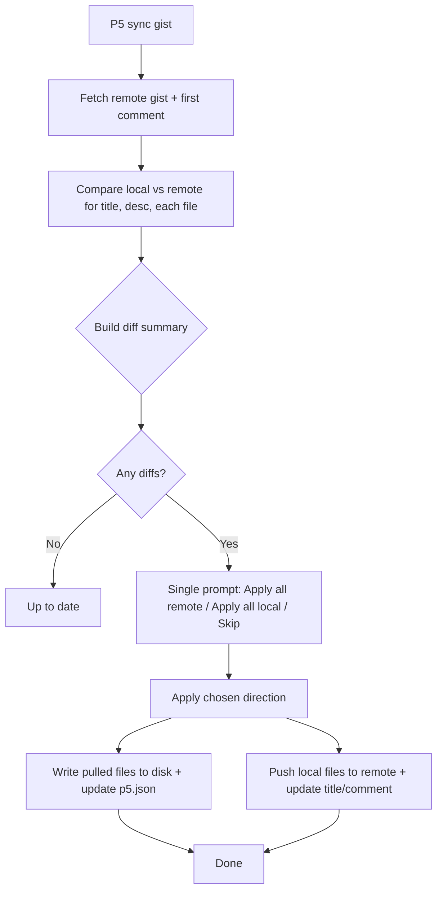
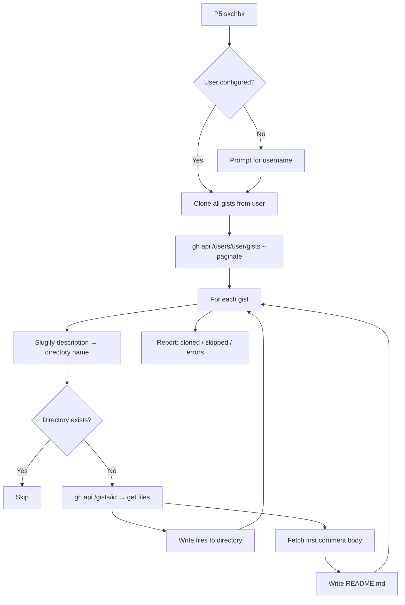

# Changelog

All notable changes since v0.5.0.

---

## v0.6.1-alpha.1

> Tag: `v0.6.1-alpha.1` — fix: resolve gist sync/edit hang caused by `gh gist edit --desc` in non-interactive mode

### Highlights
- Fixed `G.sync` and `G.edit` hanging when `gh gist edit --desc` blocks in non-interactive mode (gh ≥2.89)
- `P5 sync` deprecated; use `P5 gist sync` and `P5 update` instead
- `P5 gist sync` — gist sync moved to gist subcommand
- `P5 update [libs...]` — update all or specific installed libraries (replaces `P5 sync libs`)
- SHA256 integrity verification removed (dead code that blocked library installs)
- Gist creation and comment fixes; integration tests added

### Features
- `:P5 gist sync` — bidirectional gist sync via `gist` subcommand
- `:P5 update [libs...]` — update installed libraries (all if no args, specific if named)
- `:P5 sync` deprecated — shows error with migration hint
- Updated menu: "Sync" → "Update libraries", "Create gist" separated

### Fixes
- **G.sync hang** — replaced `gh gist edit --desc` with `gh api -X PATCH /gists/:id -f description=` to avoid blocking in non-interactive mode
- **G.edit hang** — same `gh gist edit --desc` → `gh api -X PATCH` fix
- **G.create empty description** — guard added: requires a description before creating a gist
- **G.create_comment** — now sends JSON body via `--input` file instead of raw `-f body=` argument, fixing gh CLI argument parsing
- **Temp file cleanup** — migrated `vim.fn.delete(temp_file)` → `vim.uv.fs_unlink(temp_file)` for consistency
- **SHA256 verification removed** — `core.verify_hash`, `expected_hash` option, and CI hash computation stripped; hash mismatches were silently blocking library installs
- **Unit tests** — added `G.create_comment` JSON body test and `G.create` unit test suite
- **P5 create blocking download** — project skeleton (dir, files, sketch.js, navigation) now created immediately; v2 assets download in background
- **P5 create v2 CDN URL** — switched from `cdnjs.cloudflare.com/ajax/libs/p5.js/2.0.0` to `cdn.jsdelivr.net/npm/p5@2.0.5` for reliable version availability
- **P5 create v2 sound removed** — `p5.sound.min.js` no longer downloaded for v2 (sound merged into core in p5.js 2.x), fixing a 404 that silently blocked project creation
- **P5 create v2 types** — types download made best-effort; silently skipped when unavailable (v2 has no official types yet)

### Refactoring
- `core.fetch` — removed integrity check and retry logic; unused `verify_hash` function deleted
- `gist.lua` — flattened deeply nested conditionals in `G.create` callback; moved sync title-update into callback chain instead of fire-and-forget `vim.fn.system`
- `init.lua` — extracted `handlers.update` for `:P5 update`; simplified `handlers.sync` to deprecation stub
- `project.lua` — restructured `create_project` to separate skeleton creation from asset download; v2 download chain simplified (sound removed, types best-effort); CDN switched to jsdelivr
- `libraries.lua` — dropped `expected_hash` from all `core.fetch` calls
- CI — removed `hashlib` import and `get_file_sha256` computation from `update-p5libs.yml`

---

## v0.6.0-alpha-7b9accc

> Tag: `7b9accc` — Merge branch 'pr/gist-edit'

### Highlights
- Bidirectional gist sync with per-item conflict prompts
- Gist `p5.json` stores metadata as an object (`url`, `title`, `description`) instead of a plain URL string
- Gist edit command updates both remote (GitHub) and local (`p5.json`) metadata
- Console insert mode disabled — terminal mode is blocked on focus
- **100+ p5.js code snippets** in VS Code JSON format, auto-discovered from runtimepath
- Codebase-wide cleanup: modernized APIs (`vim.system`), removed dead code, normalized notification levels

### Features
- `:P5 gist edit` — edit gist title or first comment; changes sync to both remote and `p5.json`
- `:P5 sync gist` — bidirectional sync with per-item prompts (title, description, source files)
- **Snippets** — 100+ p5.js snippets in `snippets/p5.js.json` with `p5-` prefix trigger convention
  - Lifecycle (setup, draw, preload, full sketch skeleton)
  - Paired constructs (push/pop, beginShape/endShape, loadPixels/updatePixels, createGraphics)
  - All vertex call types (vertex, curveVertex, bezierVertex, quadraticVertex)
  - Basic shapes, color & style, transformations, math & vector
  - Typography, images, events, 3D/WebGL, DOM, sound, IO
  - Common idioms (grid loop, polar loop, particles, bounce, fadeout, color palette)
  - Works with LuaSnip (from_vscode loader), blink.cmp (default/ luasnip preset), nvim-cmp
- **Removed** SHA256 integrity verification during library downloads — hash mismatches were blocking installs; `core.fetch` simplified, `libs.json` sha256 fields dropped, CI no longer computes hashes

### Gist URL format change

The `gist` field in `p5.json` now stores an object instead of a plain URL string:

```diff
- "gist": "https://gist.github.com/user/abc123"
+ "gist": {
+   "url": "user/abc123",
+   "title": "My Sketch",
+   "description": "First comment body"
+ }
```

Legacy string-format gists are still read correctly on upgrade.

### Gist Sync Flow



### Gist Create Flow

```mermaid
flowchart LR
    A[P5 gist] --> B[Copy includes to temp dir]
    B --> C[gh gist create --public --desc]
    C --> D[Extract gist ID from URL]
    D --> E[Fetch gist description via GH API]
    D --> F[Fetch first comment body]
    E --> G[Store gist = {url, title, desc} in p5.json]
    F --> G
    G --> H[Upload p5.json to gist via gh gist edit]
    H --> I[Done]
```

### Refactoring
- **gist.lua**:
  - `G.sync` replaces `G.update` — bidirectional comparison with prompts
  - `G.current` returns `{ id, url, title, description }` from object format
  - `G.create` stores full gist object with title and description metadata
  - `G.edit` updates both remote API and local `p5.json`
  - `clone_gist` writes gist metadata into cloned project's `p5.json`
  - Added missing `list_user_gists` and `clone_gist` helper functions
  - Removed redundant `G.skchbk_browse_remote` (unified into `G.clone`)
  - `G.update` → `G.sync` converted to async `vim.system` with recursive callback chaining
- **console.lua**: Disabled terminal/insert mode on console buffer; fixed `connected` variable scope; added cleanup on hide (jobstop + term close)
- **core.lua**: Removed dead `require_snacks`, redundant nil checks, cleaned up comments
- **health.lua**: Expanded checks (bundled libs, server script, websockets, gist metadata fields, python detection)
- **server.lua**: Removed duplicated validation checks, normalized notification levels
- **init.lua**: `handlers.sync` calls `gist.sync()` instead of `gist.update()`
- Normalized non-fatal notification levels from `"error"` to `"warn"` across all modules

---

## v0.6.0

> Tag: `3d11940` — feat: add skchbk command for cloning gist-based sketchbooks

### Features
- `:P5 skchbk` — clone all gists from a GitHub user's sketchbook into a local `skchbk/` directory
- `:P5 skchbk list` — browse local sketches or prompt to clone from remote
- Gists are organized into subdirectories named by slugified description
- Each cloned gist includes a `README.md` with the first comment body
- `skchbk/` directory is automatically excluded from gist uploads

### Sketchbook Clone Flow



### Fixes
- Fixed issues with `:P5 create` and console commands (`b6626ea`)

---

## v0.5.1

> Tag: `60ae1af` — fix: resolve issues with create console commands

### Fixes
- Resolved timing/interaction issues between project creation and console initialization
- Fixed release workflow to properly commit version bumps in help files
- Updated release workflow and help file content

---

## v0.5.0

> Tag: `1937008` — feat: add integrity check for downloaded assets (#23)

### Features
- SHA256 integrity verification for downloaded p5.js assets
- Automatic retry on integrity check failure
- Cache layer for asset downloads with hash verification

### Changes
- `core.fetch` now supports `expected_hash` option for integrity verification
- Asset download in `P.create_project` validates hashes before proceeding
- Cache system uses `fs_copyfile` for efficient cache restoration
