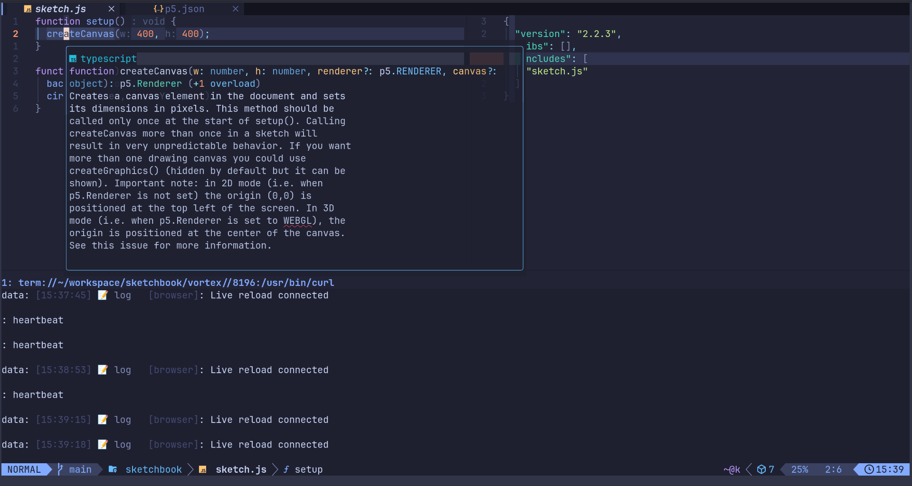

# `p5.nvim` 🌸

> Better editor support for p5.js sketchspaces in Neovim.

[](https://github.com/prjctimg/p5.nvim/releases/latest)
[](https://github.com/prjctimg/p5.nvim/actions/workflows/release.yml)
---

## On this page

- [Features ✨](#features)
- [Requirements 📋](#requirements)
- [Installation 💾](#installation-💾)
- [What's a sketchspace ?](#whats-a-sketchspace)
- [Quick Start 🚀](#quick-start-🚀)
- [Commands 📖](#commands-📖)
- [Configuration ⚡](#configuration)
- [Auto Commands 🔌](#auto-commands-🔌)
- [Keyboard Shortcuts ⌨️](#keyboard-shortcuts-️)
- [Troubleshooting 🔧](#troubleshooting-🔧)
- [License 📜](#license-📜)

---

## Features ✨

- **Live Server** 🚀 - Auto-reload preview in browser
- **Package Management** 📦 - Install contributor libraries
- **Sketchspace** 📁 - Minimal project setup
- **GitHub Gist** 🔗 - Share sketches (synced to sketchspace)
- **Console** 📺 - View browser logs in Neovim
- **p5.js Docs** 📖 - Built-in reference via snacks.picker
- **Snippets** ✂️ - 100+ p5.js code snippets (VS Code JSON format, compatible with luasnip, blink.cmp, nvim-cmp)

---

## Requirements 📋

- `nvim` >= 0.11.0
- Python 3.7+ (for development server)
- [websockets](https://pypi.org/project/websockets/) Python package (`python3-websockets` on Debian/Ubuntu, or `sudo pipx install websockets`)
- `curl` (for console streaming)
- `lsof` (checking ports)

---

## Installation 💾

```lua
-- lazy.nvim (installs latest release)
{
  "prjctimg/p5.nvim",
  dependencies = {
    "nvim-lua/plenary.nvim",
  },
  config = function()
    require("p5").setup({})
  end
}
```

---

## What's a sketchspace ?

A directory that has a `p5.json` file is called a `sketchspace`. The file looks like this:

```json
{
  "version": "2.0.0",
  "major": 2,
  "libs": {},
  "includes": ["sketch.js"],
  "gist": {
    "url": "username/gistId",
    "title": "My Sketch",
    "description": "Description from gist comment"
  }
}
```

- `version`: p5.js version to use
- `major`: p5.js major version (`1` or `2`)
- `libs`: Object with library names as keys and their versions as values
- `includes`: Files to include in the Gist (default: `["sketch.js"]`)
- `gist`: Gist metadata object (optional) with `url` (`"user/gistId"`), `title`, and `description`

> [!important]
>
> This file is needed for setting up and running `sketchspaces`.
>
> It currently only works with this plugin.

---

## Quick Start 🚀

```vim
:P5 create my-sketch
:P5 server
:P5 console
```

---

## Commands 📖

### :P5 (interactive menu)

Open an interactive menu with all available commands. This is the default when
`:P5` is called without arguments.

```vim
:P5              # Open interactive menu
```

The menu shows context-aware labels (e.g. "Stop server" when the server is
running vs "Start server" when it's not).

---

### :P5 create [name]

Create a new sketchspace.

```vim
:P5 create my-sketch
:P5 create
```

When prompted for a version, selecting **Latest (2.x)** will skip TypeScript type definitions
until the p5.js 2.x type declarations are officially released. The project is created
immediately with everything else — you can start coding right away. Run `:P5 setup` later
to copy types once they become available.


---

### :P5 setup

Setup assets in current sketchspace.

Downloads files from gist (if configured), creates default sketch.js if missing, copies assets, generates libs.js, and installs configured libraries.

```vim
:P5 setup
```

---

### :P5 install [libs...]

Install contributor libraries. Use picker or specify directly.

```vim
:P5 install ml5
:P5 install ml5 rita p5play
:P5 install
```

### :P5 uninstall [libs...]

Remove installed libraries.

```vim
:P5 uninstall ml5
:P5 uninstall
```


---

### :P5 server [port]

Start/stop the development server (toggle). Opens browser automatically and enables live reload.

```vim
:P5 server
:P5 server 8080
```


---

### :P5 console

Toggle browser console to view console.log, errors, and warnings in Neovim.

```vim
:P5 console
```


---

### :P5 gist [desc|sync|edit]

Create, sync, or edit a GitHub Gist from your sketchspace.

```vim
:P5 gist "My awesome sketch"     # Create gist with title
:P5 gist                         # Prompt for title then create
:P5 gist sync                    # Bidirectional sync (title, description, files)
:P5 gist edit                    # Edit gist title or first comment
```

On creation, stores `gist` as an object in `p5.json` with `url`, `title`,
and `description` (from the gist's first comment).

When syncing, compares remote vs local state and prompts per difference:
title, description (first comment), and each source file. Files existing on
only one side are auto-accepted.

Use `:P5 gist edit` to change the title or first comment — changes sync
both to the remote gist and the local `p5.json`.

---

### :P5 update [libs...]

Update all installed libraries or specific ones.

```vim
:P5 update                       # Update all installed addons
:P5 update ml5 p5play            # Update specific libraries
```

---

### :P5 skchbk [list]

Clone all gists from a GitHub user into a local `skchbk/` directory. Each gist is saved in its own subdirectory named after the gist description.

Requires a [dedicated GitHub account](https://docs.github.com/en/gists) whose gists are all valid p5.js sketches.

```vim
:P5 skchbk                # Clone all gists from configured user
:P5 skchbk list           # Browse local sketches or browse/list remotely
```

If `skchbk/` doesn't exist or is empty, `:P5 skchbk list` prompts you to clone all gists or browse them remotely and clone individual ones.

The `skchbk/` directory is automatically excluded from gist uploads.

---

### :P5 list

Open a picker of recently used sketchspaces and change directory to the
selected one.

```vim
:P5 list
```

---

### :P5 docs

Open p5.js documentation via snacks.picker.

```vim
:P5 docs
```


---

## Snippets ✂️

p5.nvim ships with 100+ p5.js code snippets in VS Code JSON format. All snippets use a `p5-` prefix to avoid conflicts with other snippet packs.

### Installation

Snippets are auto-discovered from runtimepath. Just add a snippet loader:

**LuaSnip:**

```lua
require("luasnip.loaders.from_vscode").lazy_load()
```

**blink.cmp (default preset):** Auto-discovered, zero configuration.

**blink.cmp (luasnip preset):**

```lua
-- Already using luasnip? snippets are auto-discovered via luasnip
sources = {
  default = { "lsp", "path", "snippets", "buffer" },
}
```

**nvim-cmp:**

```lua
cmp.setup({
  snippet = {
    expand = function(args)
      require("luasnip").lsp_expand(args.body)
    end,
  },
  sources = {
    { name = "luasnip" },
  },
})
```

### Trigger Convention

Type `p5-` followed by the snippet name in a `.js` file to trigger:

| Category | Example Trigger | Expands To |
|----------|----------------|------------|
| Lifecycle | `p5-sketch`, `p5-setup`, `p5-draw`, `p5-preload` | Full sketch skeleton or function |
| Paired constructs | `p5-push`, `p5-beginshape`, `p5-loadpixels`, `p5-creategraphics` | Block with open/close calls |
| Vertex calls | `p5-vertex`, `p5-curvevertex`, `p5-beziervertex` | Single vertex() inside shape |
| Basic shapes | `p5-canvas`, `p5-circle`, `p5-rect`, `p5-line` | Common 2D primitives |
| Color & style | `p5-fill`, `p5-stroke`, `p5-nofill`, `p5-colormode-hsb` | Color and attribute setters |
| Transformations | `p5-translate`, `p5-rotate`, `p5-scale` | Coordinate transforms |
| Math & vector | `p5-map`, `p5-constrain`, `p5-random`, `p5-vector` | Math utilities |
| Typography | `p5-text`, `p5-textsize`, `p5-loadfont`, `p5-textalign` | Text rendering |
| Images | `p5-loadimage`, `p5-pixels`, `p5-tint`, `p5-filter` | Image loading and processing |
| Events | `p5-mousepressed`, `p5-keypressed`, `p5-mousedragged` | Input event handlers |
| 3D / WebGL | `p5-box`, `p5-sphere`, `p5-orbitcontrol`, `p5-texture` | 3D primitives and lights |
| DOM | `p5-createslider`, `p5-createbutton`, `p5-createselect` | UI elements |
| Sound | `p5-loadsound`, `p5-fft`, `p5-oscillator` | Audio playback and analysis |
| IO | `p5-loadjson`, `p5-loadstrings`, `p5-savecanvas` | Data loading and saving |
| Common idioms | `p5-forgrid`, `p5-forpolar`, `p5-particles`, `p5-bounce` | Multi-line patterns |

### Example

Typing `p5-sketch` and expanding gives:

```javascript
function setup() {
  createCanvas(400, 400);
}

function draw() {
  background(220);
}
```

Typing `p5-beginshape` and expanding gives:

```javascript
beginShape();
  vertex(x, y)
endShape(CLOSE);
```

All tab stops (`$1`, `$2`, etc.) are navigable; press `<Tab>` to jump between
them (requires luasnip or blink.cmp luasnip preset).

---

## Configuration ⚡

```lua
require("p5").setup({
  -- Server settings
  server = {
    port = 8000,                    -- Server port
    auto_start = false,             -- Auto start server when opening sketch.js
    auto_open_browser = true,      -- Open browser automatically

    -- Live reload settings
    live_reload = {
      enabled = true,               -- Enable live reload
      port = 12002,                -- Live reload port
      debounce_ms = 300,           -- Debounce delay
      watch_extensions = {".js", ".css", ".html", ".json"},  -- Files to watch
      exclude_dirs = {".git", "node_modules", "dist", "build"}  -- Exclude directories
    }
  },

  -- Console settings
  console = {
    enabled = true,                 -- Enable console integration
    position = "below",             -- Window position: below, above, left, right
    height = 10,                    -- Window height (lines)
  },

  -- Library settings
  libraries = {
    auto_update = false            -- Auto update libraries on setup
  },

  -- Sketchbook settings
  sketchbook = {
    user = ""                      -- GitHub username whose gists form the sketchbook
  }
})
```

---

## Auto Commands 🔌

Auto-start server when opening a sketch.js file:

```lua
-- Auto-start server when opening sketch.js
vim.api.nvim_create_autocmd({ "BufEnter" }, {
  pattern = "sketch.js",
  callback = function()
    vim.cmd("P5 server")
  end
})

-- Auto-open console when server starts
vim.api.nvim_create_autocmd({ "User", "P5ServerStarted" }, {
  callback = function()
    vim.cmd("P5 console")
  end
})
```

---

## Keyboard Shortcuts ⌨️

Example keybindings using `<leader>p` prefix:

```lua
-- General
vim.keymap.set("n", "<leader>p5", ":P5<CR>", { desc = "Open p5.nvim picker" })

-- Project
vim.keymap.set("n", "<leader>pc", ":P5 create ", { desc = "Create project" })
vim.keymap.set("n", "<leader>ps", ":P5 setup<CR>", { desc = "Setup project" })

-- Server
vim.keymap.set("n", "<leader>pss", ":P5 server<CR>", { desc = "Toggle server" })
vim.keymap.set("n", "<leader>pso", ":P5 console<CR>", { desc = "Toggle console" })

-- Libraries
vim.keymap.set("n", "<leader>pi", ":P5 install ", { desc = "Install library" })
vim.keymap.set("n", "<leader>pu", ":P5 uninstall ", { desc = "Uninstall library" })
vim.keymap.set("n", "<leader>pU", ":P5 sync libs<CR>", { desc = "Update libraries" })

-- Gist
vim.keymap.set("n", "<leader>pg", ":P5 gist ", { desc = "Create gist" })
vim.keymap.set("n", "<leader>pgg", ":P5 gist sync<CR>", { desc = "Sync gist" })

-- Docs
vim.keymap.set("n", "<leader>pd", ":P5 docs<CR>", { desc = "Open p5.js docs" })
```

---

## Troubleshooting 🔧

### Server Won't Start

**Symptoms:** Running `:P5 server` shows an error or nothing happens.

**Solutions:**

1. Ensure Python 3 is installed:

   ```bash
   python3 --version
   ```

2. Check if the port is already in use:

   ```bash
   lsof -i :8000
   ```

3. Try a different port:

```vim
   :P5 server 8080
```

1. Check Neovim notifications for specific error messages

### Downloads Not Working

Library installation fails or downloads timeout.

**Solutions:**

1. Ensure curl is installed:

   ```bash
   curl --version
   ```

2. Check internet connection:

   ```bash
   curl -I https://cdnjs.cloudflare.com
   ```

3. Verify firewall isn't blocking `localhost` connections

4. Check that you're in a valid sketchspace (has `p5.json`)

### Gist Upload/Sync Fails

`:P5 gist` or `:P5 sync gist` shows an error.

**Solutions:**

1. Ensure GitHub CLI is installed:

   ```bash
   gh --version
   ```

2. Authenticate with GitHub:

   ```bash
   gh auth login
   ```

3. Verify gist URL in `p5.json` is valid:

   ```vim
   :edit p5.json
   ```

4. For sync failures, the gist may have been deleted - run `:P5 gist` to create a new one

### Library Install/Uninstall Fails

`:P5 install` or `:P5 uninstall` shows an error.

**Solutions:**

1. Verify you're in a sketchspace (directory with a `p5.json` file):

   ```bash
   ls p5.json
   ```

2. Check assets/libs directory is writable:

   ```bash
   ls -la assets/libs
   ```

3. Run setup first to initialize:

   ```vim
   :P5 setup
   ```

---

> ## License 📜

> (c) 2026, [prjctimg](https://prjctimg.me)
>
> This is free software, released under the GPL-3.0 license.

---
---
